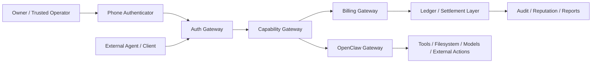

# OpenClaw Capability + Billing Gateway

This document describes a practical security and economics model for running a highly autonomous
agent framework such as `OpenClaw` without turning it into a free, unaudited public resource.

The core design goal is not:

- "nobody should be able to reach my agent"

The real goal is:

- "nobody should be able to consume my compute, data, tools, and risk budget without identity,
  authorization, accounting, and payment"

## Design Principle

In an agent-native network, information is not "free".

- model inference consumes compute
- tool calls consume execution budget and risk budget
- data access consumes bandwidth, storage, privacy budget, and trust
- external actions consume liability

These are all resources. Resources should be:

- identified
- scoped
- metered
- priced
- settled
- auditable

In this model, tokens are not "food" for agents in a vague sense. They are accounting units for
resource consumption and authorization.

## What Problem This Solves

For high-autonomy agent operators, the main risk is often not simple unauthorized access.

The actual problem is:

- external callers can trigger expensive tasks
- external callers can consume local compute or valuable data
- external callers can induce execution risk
- external callers may never pay
- external callers may reuse one approval to gain more power than intended

This architecture turns the problem from "block all access" into:

- allow access
- verify identity
- issue bounded capabilities
- meter resource usage
- settle payment
- record outcome

## Threat Model

We assume:

- `OpenClaw` should remain highly autonomous for trusted local use
- untrusted or semi-trusted external clients may still be allowed to request work
- the operator does not want free riding
- the operator does not want one external channel to inherit full local authority
- payment and authorization should be first-class, not an afterthought

We explicitly distinguish:

- local trusted owner control
- local trusted automation
- remote semi-trusted agent callers
- public or low-trust callers

These must not share the same trust boundary.

## Architecture

## The Four Ledgers

The system should track four distinct ledgers.

### 1. Identity Ledger

Tracks:

- who the owner is
- which agent is registered
- which caller is requesting work
- what trust tier the caller belongs to

Candidate primitives:

- phone passkey / Secure Enclave-backed signing
- chain-based agent identity such as ERC-8004

### 2. Capability Ledger

Tracks:

- what the caller may do
- for how long
- under what scope
- with what budget ceiling

Examples:

- read-only access to a research endpoint
- one-time permission to run a bounded command
- permission to spend up to 5 USDC
- permission to touch only one workspace path

### 3. Resource Ledger

Tracks:

- model tokens consumed
- local compute time consumed
- data fetched or processed
- tool calls executed
- paid external APIs consumed

This is the accounting layer that turns "agent work" into measurable cost.

### 4. Result Ledger

Tracks:

- output quality
- success or failure
- latency
- whether cost matched value
- feedback and reputation

This ledger feeds reputation and future pricing.

## Core Components

### Phone Authenticator

Role:

- strong owner authentication
- high-risk action approval
- capability issuance trigger

Important design note:

- Face ID or fingerprint is not the network credential
- the real credential is a hardware-protected signing key unlocked by biometrics

In practice:

- iPhone passkey
- Secure Enclave-backed signing key
- short challenge-response approval

### Auth Gateway

Role:

- verifies who is asking
- verifies whether the caller is trusted, semi-trusted, or public
- validates phone-signed owner approvals for high-risk actions

Output:

- signed authorization result
- caller identity claims
- trust tier

### Capability Gateway

Role:

- converts identity into bounded permissions
- issues short-lived capability tokens
- attaches scope, budget, and expiry

Example capability fields:

- `subject`
- `allowed_tools`
- `allowed_paths`
- `max_spend`
- `max_runtime_seconds`
- `expires_at`
- `nonce`

### Billing Gateway

Role:

- meters work
- prices resource usage
- verifies prepaid balance or payment proof
- settles or reserves cost before execution

Candidate payment models:

- prepaid credits
- stablecoin settlement
- x402 payment-required flow
- operator-issued quotas

### OpenClaw Gateway

Role:

- remains the execution engine
- should not be directly exposed as the payment and authorization boundary
- only accepts elevated or risky work after capability verification

This preserves autonomy while preventing the raw agent from becoming a free public utility.

## Trust Tiers

The simplest stable model is a four-tier system.

### Tier 0: Free Observation

Allowed:

- health
- metadata
- public capability discovery

Denied:

- tools
- private data
- paid model usage

### Tier 1: Paid Low-Risk Access

Allowed:

- bounded read APIs
- summarization
- public or low-risk data retrieval

Requirements:

- identity
- billing

### Tier 2: Authorized Tool Use

Allowed:

- scoped filesystem work
- bounded command execution
- model inference with budget caps

Requirements:

- identity
- billing
- capability token

### Tier 3: High-Risk Execution

Allowed only with explicit owner approval:

- system changes
- privileged actions
- high-cost actions
- publishing or irreversible side effects

Requirements:

- phone approval
- short TTL capability
- strict audit trail

## Why Phone Biometrics Matter

Phone biometrics are not just convenience. They provide a practical owner-presence signal for
high-risk authorization.

This works well because:

- the phone is already your daily trust anchor
- mobile OSes already protect biometrics and hardware keys
- approval UX is much better than asking users to manage raw keys directly

The right pattern is:

1. external caller requests a sensitive action
2. gateway creates a challenge
3. owner approves on phone with biometrics
4. phone signs challenge
5. gateway verifies and issues a narrow capability
6. agent executes only within that capability

## Why This Should Not Be Fully On-Chain

Chain should not be the real-time control plane for every command.

On-chain is good for:

- identity registration
- budget pools
- payment settlement
- revocation
- reputation

On-chain is not ideal for:

- every local command
- every file write
- millisecond authorization loops

The correct split is:

- local fast path for capability verification
- chain-backed slow path for identity, pricing, balance, and revocation

## Mapping to Existing Protocols

### ERC-8004

Good fit for:

- agent identity
- trust discovery
- reputation
- validation policy hooks

Use it to answer:

- which agent is this
- what endpoint is it allowed to represent
- how trustworthy has it been historically

### x402

Good fit for:

- pay-per-request APIs
- machine-to-machine settlement
- HTTP-native payment gating

Use it to answer:

- has the caller paid
- what budget was authorized
- can this request proceed

## Recommended OpenClaw Integration

For `OpenClaw`, the safest model is not "one gateway with all powers and all users".

Recommended split:

- private `OpenClaw` gateway for owner and trusted local automation
- public or semi-public `Access Gateway` for external callers

The `Access Gateway` should:

- verify caller identity
- verify payment or balance
- issue capability tokens
- never expose direct unrestricted shell or unrestricted filesystem access

The private `OpenClaw` runtime may remain highly autonomous, but only behind this boundary.

## Minimum Viable Version

The first version does not need full chain settlement for everything.

### v1

- owner phone approval via passkey or Secure Enclave key
- local capability token service
- `OpenClaw` execution only after capability validation
- local accounting log
- prepaid budget table

### v1.5

- add x402 payment-required flows for selected APIs
- add external caller identities
- add per-caller quotas and rate limits

### v2

- ERC-8004 style agent identity registration
- reputation and execution history
- on-chain budget and revocation

## Product Philosophy

This system is not fundamentally an antivirus or lock-down layer.

It is an agent economy boundary.

The philosophy is:

> I do not mind being accessed.  
> I mind being accessed without identity, without payment, without scope, and without accounting.

That is the right framing for highly autonomous personal agent systems.

## Practical Rule Set

If implementing this around `OpenClaw`, use these rules:

- never expose high-risk tools directly to public channels
- every external request must map to an identity
- every identity must map to a trust tier
- every trust tier must map to a capability ceiling
- every nontrivial capability must map to a budget
- every execution must map to an audit record
- high-risk actions require owner-presence approval from phone

## Open Questions

Before building production flows, answer:

- where does pricing come from
- what actions are billable versus bundled
- when is payment reserved versus settled
- what happens on failure or partial completion
- how are disputes handled
- how long should capabilities live
- what can be delegated recursively to other agents

## Suggested Next Build Step

Implement a local `Capability Gateway v1` with:

- phone challenge approval
- one signed short-lived capability token format
- per-tool and per-path scopes
- simple prepaid credit accounting
- `OpenClaw` policy hook that rejects risky actions without capability

This creates the first meaningful boundary between "autonomous" and "free for anyone to exploit".
